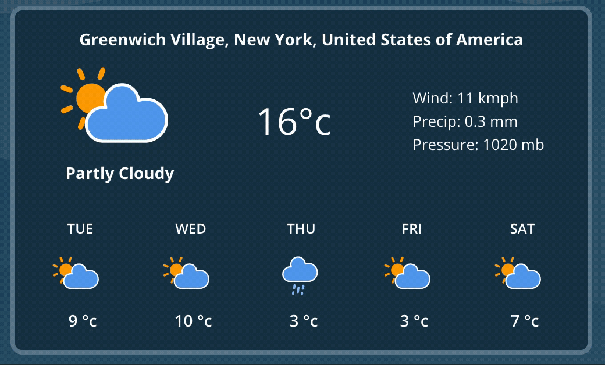
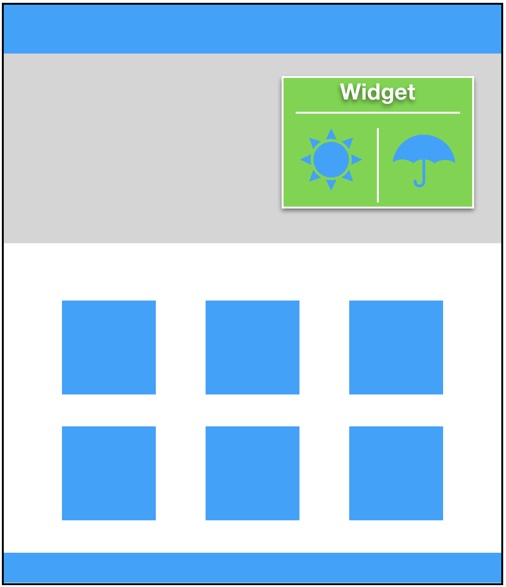

# Weather Widget

1. Fork
1. Clone
1. Deploy on GitHub Pages
1. PR (include your deployment url)

### Task

Your task is to build a weather widget using **one** of the following third-party apis:
- https://openweathermap.org/appid
- https://weatherstack.com

There is starter code in this repo. You're welcome to modify as you see fit.

Make sure it works on mobile!

**Concept:**

